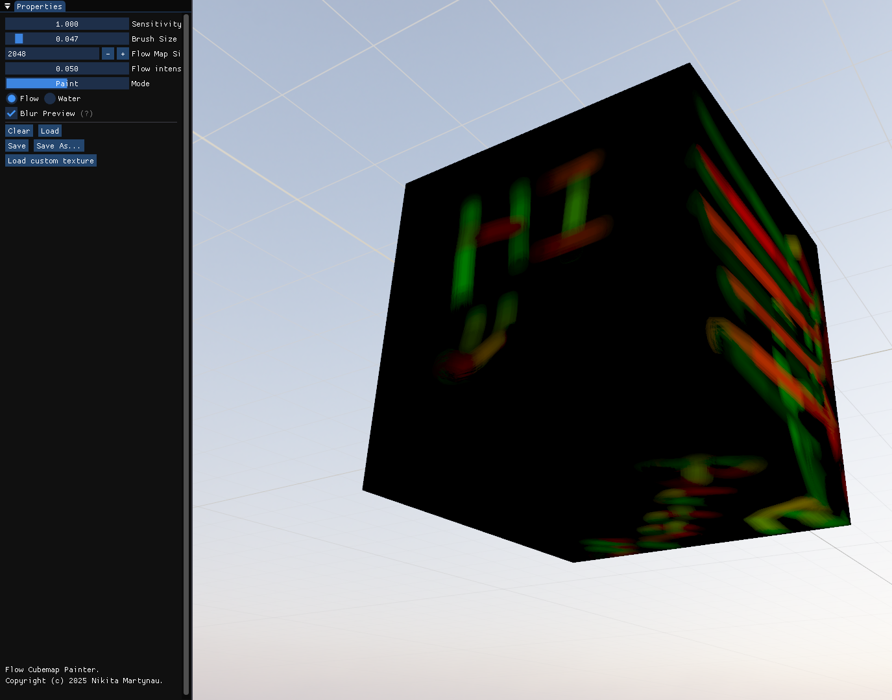
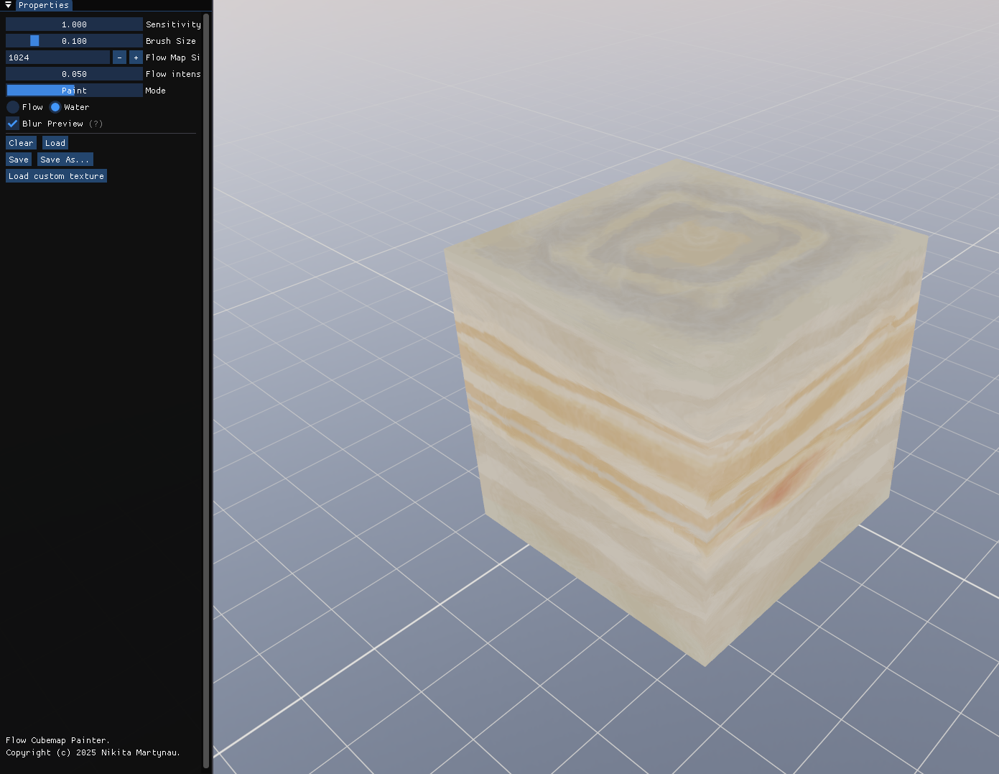

Introduction
===
A flow map editor, but on a cube. Inspired by this [flow map painter](https://teckartist.com/?page_id=107). 
It allows you to draw directions (flow) onto a cube, and import/export drawings using different layouts.

You can dock the properties window by dragging it by the top header.
To orbit the cube, drag with the right mouse button or use the arrow keys.
Scroll to change the orbit radius.
Draw using the left mouse button.
Once you're done, press the 'Save As...' button, choose the layout, file type, and number of blur steps (0 means no blur), then save.
Import your custom cube texture by clicking `Load custom texture`.

# Image formats
The editor can save images with .png and .hdr file types.

The following layouts are supported for saving and loading.

## equirectangular
Panorama layout. A single image.
## unwrapped cube
A single image with the following layout:
```
+----+----+----+
| X+ | Y+ | Z+ |
+----+----+----+
| X- | Y- | Z- |
+----+----+----+
```
Or
```
+-------+--------+-------+
| Right | Top    | Front |
+-------+--------+-------+
| Left  | Bottom | Back  |
+-------+--------+-------+
```
## six images
A folder containing six images with the following names:
"right", "left", "top", "bottom", "front", "back".

---

If something is unclear or you found a bug, please create a github issue or a pull request. Thanks!

Build
===

You can get the program in the [releases tab](https://github.com/NikitaWeW/FlowCubemapEditor/releases/latest), or by compiling it yourself:

``` shell
cmake -S . -B build
cmake --build build
cmake --install build --prefix build/install
```

HDR flowmaps
===

There is an option to bake the flowmap in HDR, which means values won’t be clamped to 1. **HDR flowmaps may look strange at first.** Most image formats don’t support negative values, so to work around this, I stored the sign in the blue and alpha channels (1 indicates a negative sign, 0 indicates positive). To retrieve the true flow value, use the following:

```
    red   = blue  ? -red : red;
    green = alpha ? -green : green;
```

